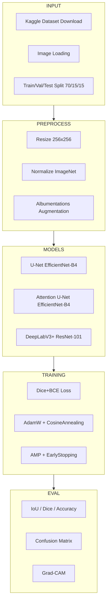
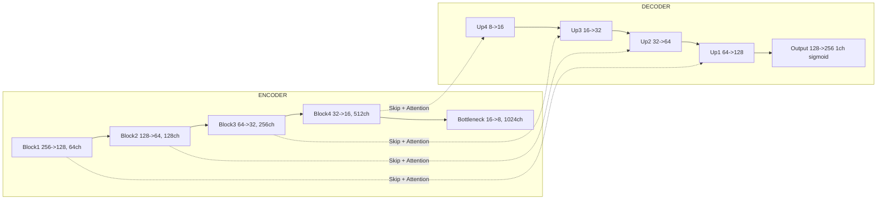
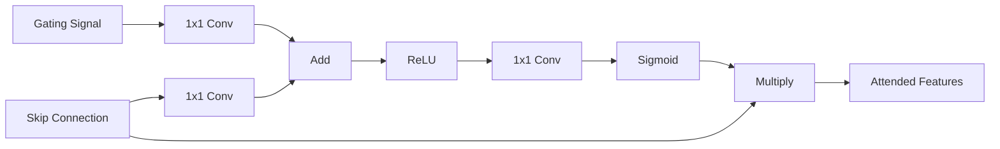

<h1 align="center">
  <br>
  ForestSight AI
  <br>
  <sub>Forest Detection from Satellite Imagery Using Deep Learning</sub>
  <br>
</h1>

<p align="center">
  <b>Software Requirements Specification</b><br>
  Version 1.0 -- March 2026<br>
  IEEE 830-2024 Compliant
</p>

<p align="center">
  
  
  
  
</p>

---

## Table of Contents

| # | Section | Description |
|---|---------|-------------|
| 1 | [Introduction](#1-introduction) | Purpose, scope, definitions |
| 2 | [Overall Description](#2-overall-description) | Product perspective, constraints |
| 3 | [System Architecture](#3-system-architecture) | Pipeline design, model architecture |
| 4 | [Functional Requirements](#4-functional-requirements) | Feature specifications |
| 5 | [Non-Functional Requirements](#5-non-functional-requirements) | Performance, scalability |
| 6 | [Data Dictionary](#6-data-dictionary) | Dataset schema, hyperparameters |
| 7 | [Model Comparison Matrix](#7-model-comparison-matrix) | Architecture benchmarking |
| 8 | [Evaluation Criteria](#8-evaluation-criteria) | Metrics, validation strategy |
| 9 | [Risk Analysis](#9-risk-analysis) | Mitigation strategies |
| 10 | [References](#10-references) | Papers, datasets, libraries |

---

## 1. Introduction

### 1.1 Purpose

This document specifies the software requirements for **ForestSight AI** -- a deep learning system that performs **binary semantic segmentation** on aerial/satellite imagery to classify each pixel as either *forest* or *non-forest*.

### 1.2 Scope

| Aspect | Detail |
|--------|--------|
| **Problem** | Automated forest cover detection from satellite/aerial RGB imagery |
| **Approach** | Binary semantic segmentation using encoder-decoder CNNs |
| **Input** | RGB aerial images (256x256 pixels) |
| **Output** | Binary segmentation masks (forest=1, non-forest=0) |
| **Deliverable** | Modular Python package + Jupyter notebook + CLI trainer |

### 1.3 Definitions & Acronyms

| Term | Definition |
|------|-----------|
| **IoU** | Intersection over Union (Jaccard Index) |
| **Dice Score** | 2x overlap / total pixels |
| **ASPP** | Atrous Spatial Pyramid Pooling |
| **AMP** | Automatic Mixed Precision |
| **SMP** | Segmentation Models PyTorch |
| **Grad-CAM** | Gradient-weighted Class Activation Mapping |

### 1.4 References

| # | Reference | Type |
|---|-----------|------|
| R1 | Kaggle: Forest Aerial Images for Segmentation | Dataset |
| R2 | Ronneberger et al., "U-Net", 2015 | Paper |
| R3 | Oktay et al., "Attention U-Net", 2018 | Paper |
| R4 | Chen et al., "DeepLabV3+", 2018 | Paper |
| R5 | Segmentation Models PyTorch (SMP) | Library |

---

## 2. Overall Description

### 2.1 Product Perspective


### 2.2 User Characteristics

| User Type | Technical Level | Use Case |
|-----------|----------------|----------|
| ML Researcher | Expert | Extend architectures, experiment |
| Environmental Scientist | Intermediate | Run inference on new images |
| Student | Beginner | Learn segmentation from documented code |

### 2.3 Operating Environment

| Component | Requirement |
|-----------|-------------|
| Python | >= 3.10 |
| PyTorch | >= 2.0 |
| RAM | >= 8 GB |
| GPU | NVIDIA >= 4 GB VRAM (recommended) |
| Storage | >= 2 GB |

---

## 3. System Architecture

### 3.1 High-Level Pipeline



### 3.2 Encoder-Decoder Architecture



### 3.3 Attention Gate



### 3.4 Scalable Project Structure

```
forest_detection/
├── src/
│   ├── __init__.py
│   ├── config.py          # Dataclass configuration
│   ├── dataset.py         # Dataset, augmentation, dataloaders
│   ├── models.py          # Model factory (registry pattern)
│   ├── losses.py          # Dice+BCE combined loss
│   ├── metrics.py         # IoU, Dice, Accuracy, Precision, Recall
│   ├── trainer.py         # Training engine with AMP + early stopping
│   └── visualize.py       # All plotting utilities
├── train.py               # CLI entry point (argparse)
├── forest_detection.ipynb # Interactive notebook
├── Dockerfile             # Container deployment
├── SRS.md                 # This document
├── requirements.txt       # Dependencies
└── .gitignore
```

---

## 4. Functional Requirements

### 4.1 Data Management

| ID | Requirement | Priority |
|----|-------------|----------|
| FR-01 | Use a local dataset by default; download Kaggle data only when explicitly requested | High |
| FR-02 | Validate image-mask pairing, image decodability, and matching dimensions | High |
| FR-03 | Train/Val/Test split (70/15/15) | High |
| FR-04 | Albumentations augmentation | High |
| FR-05 | PyTorch DataLoader with configurable batch size | High |

### 4.2 Model Training

| ID | Requirement | Priority |
|----|-------------|----------|
| FR-06 | Train U-Net, Attention U-Net, DeepLabV3+ | High |
| FR-07 | Pretrained ImageNet encoders | High |
| FR-08 | Dice + BCE combined loss | High |
| FR-09 | Mixed precision (AMP) | Medium |
| FR-10 | Early stopping (patience=10) | High |
| FR-11 | CLI with --epochs, --batch-size, --models args | High |

### 4.3 Evaluation

| ID | Requirement | Priority |
|----|-------------|----------|
| FR-12 | IoU, Dice, Accuracy, Precision, Recall | High |
| FR-13 | Model comparison table | High |
| FR-14 | Prediction overlay visualization | High |
| FR-15 | Confusion matrix heatmap | Medium |
| FR-16 | Grad-CAM heatmaps | Medium |

---

## 5. Non-Functional Requirements

| ID | Requirement | Target |
|----|-------------|--------|
| NFR-01 | IoU on test set | >= 0.85 |
| NFR-02 | Dice on test set | >= 0.90 |
| NFR-03 | Training time (single GPU) | < 30 min |
| NFR-04 | Inference latency | < 50ms/image |
| NFR-05 | Reproducibility | seed=42 |
| NFR-06 | GPU VRAM | < 4 GB at batch_size=16 |
| NFR-07 | Containerized deployment | Dockerfile provided |

---

## 6. Data Dictionary

### 6.1 Dataset Schema

| Field | Type | Shape | Description |
|-------|------|-------|-------------|
| image | RGB uint8 | (H, W, 3) | Aerial photograph |
| mask | Binary uint8 | (H, W, 1) | 0=non-forest, 1=forest |

### 6.2 Hyperparameters

| Parameter | Value | Rationale |
|-----------|-------|-----------|
| image_size | 256x256 | Balance resolution vs memory |
| batch_size | 16 | Fits 4GB VRAM |
| learning_rate | 1e-4 | Standard for fine-tuning |
| weight_decay | 1e-4 | L2 regularization |
| epochs | 50 | With early stopping |
| early_stop_patience | 10 | Prevent overfitting |
| dice_weight | 0.5 | Combined loss balance |
| bce_weight | 0.5 | Combined loss balance |

---

## 7. Model Comparison Matrix

| Feature | U-Net | Attention U-Net | DeepLabV3+ |
|---------|-------|-----------------|------------|
| Encoder | EfficientNet-B4 | EfficientNet-B4 | ResNet-101 |
| Decoder | Standard | + Attention Gates | ASPP + Bilinear |
| Parameters | ~25M | ~26M | ~60M |
| Strengths | Fast baseline | Precise boundaries | Multi-scale context |
| Expected IoU | 0.82-0.86 | 0.85-0.90 | 0.84-0.89 |

---

## 8. Evaluation Criteria

| Metric | Formula | Target |
|--------|---------|--------|
| IoU | TP / (TP+FP+FN) | >= 0.85 |
| Dice | 2TP / (2TP+FP+FN) | >= 0.90 |
| Pixel Accuracy | (TP+TN) / Total | >= 0.92 |
| Precision | TP / (TP+FP) | >= 0.88 |
| Recall | TP / (TP+FN) | >= 0.88 |

---

## 9. Risk Analysis

| Risk | Probability | Impact | Mitigation |
|------|------------|--------|------------|
| No GPU available | Medium | High | CPU fallback, reduced batch size |
| Overfitting | Medium | High | Early stopping, augmentation, pretrained encoders |
| Class imbalance | Low | Medium | Dice loss handles imbalance |
| Memory overflow | Low | High | AMP, gradient accumulation |

---

## 10. References

1. Ronneberger et al. (2015). U-Net: Convolutional Networks for Biomedical Image Segmentation.
2. Oktay et al. (2018). Attention U-Net: Learning Where to Look for the Pancreas.
3. Chen et al. (2018). Encoder-Decoder with Atrous Separable Convolution (DeepLabV3+).
4. Tan & Le (2019). EfficientNet: Rethinking Model Scaling.
5. Selvaraju et al. (2017). Grad-CAM: Visual Explanations from Deep Networks.
